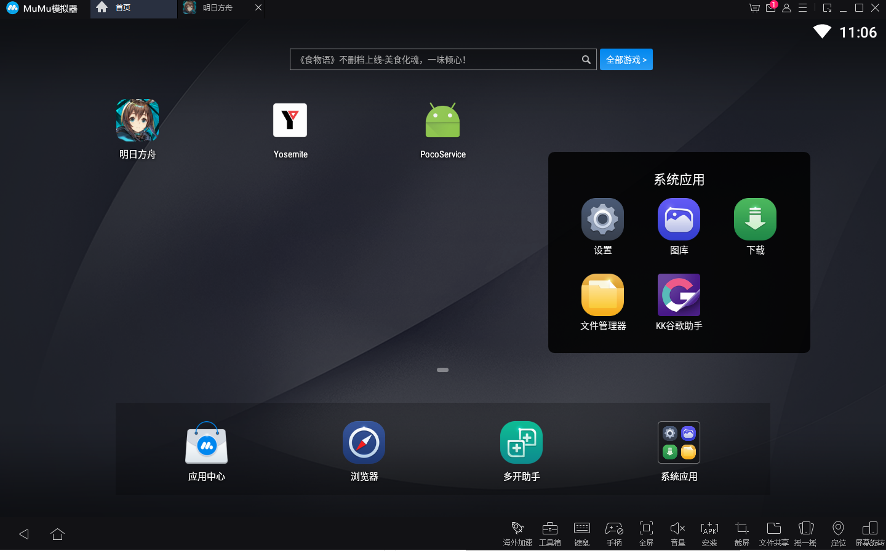
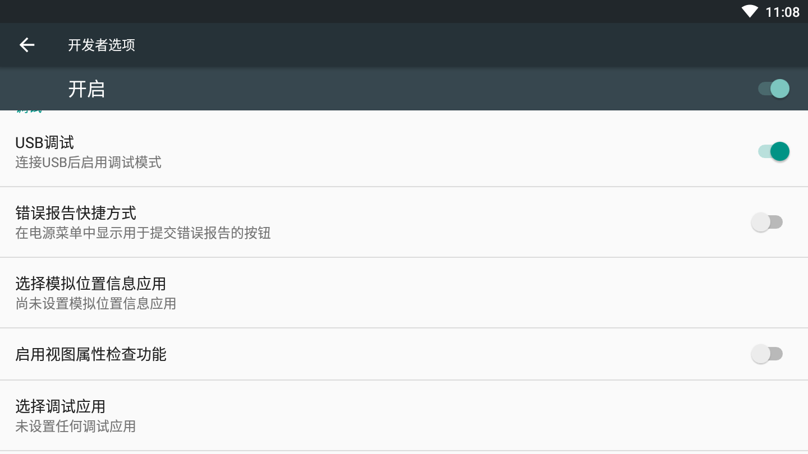
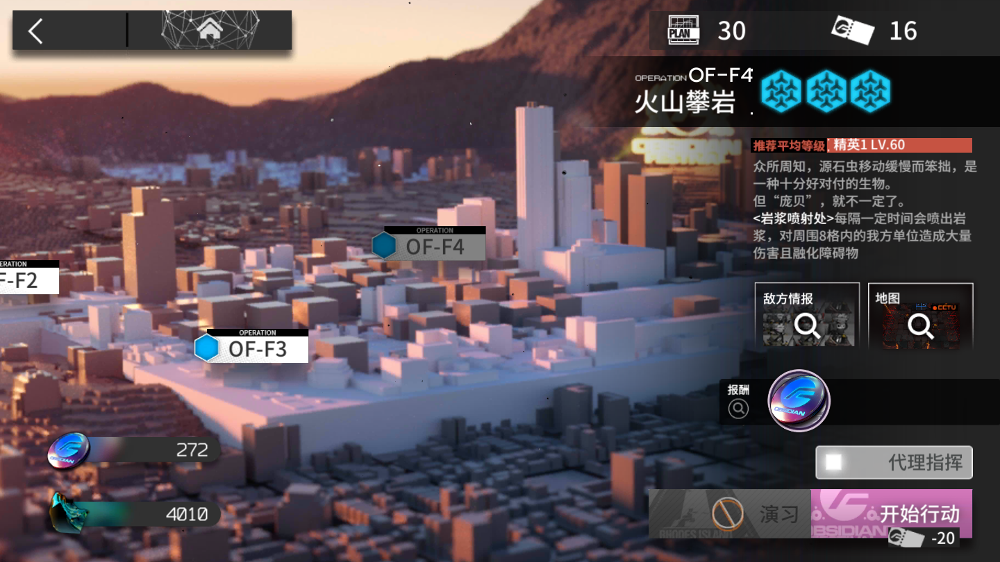

# 明日方舟脚本使用指南
## 注意
**本指南需要对python及配置python虚拟环境有简单的知识储备。请在阅读之前查阅相关资料。**
## 简述
该脚本基于Airtest IDE以及明日方舟PC模拟器编写，可对指定**已经可以代理指挥**的副本内反复战斗，自动使用理智合剂，并且记录战斗以及代理指挥失误次数。战斗的次数可以通过修改参数设置。

ps: 该脚本在Windows下可以正常运行，理论上也可以支持macos，如果macos上不能正常运行，请提issue或联系我（联系方式在最后）。至于Linux，如果有Linux版mumu模拟器也可以，因为脚本目前仅适用于mumu模拟器

## 需要的软件
明日方舟PC模拟器：访问[明日方舟官网](https://ak.hypergryph.com/index)，选择PC模拟器

ps: macos用户可以下载mumu模拟器，然后在mumu中安装明日方舟
## 如何下载脚本
### 两种方法
1. ```git clone git@github.com:yeziyezi/airtest-arknights.git -b v1.1```
2. Clone or download - Download ZIP，然后保存到本地并解压
## 运行步骤
### 模拟器准备工作
1. 打开明日方舟PC模拟器，
2. 在模拟器-首页-设置-开发者选项中打开usb调试


3. 选择要刷的关卡，点击一下，使开始行动的图标显示在界面上，比如这样

### 运行脚本
#### 1.准备python虚拟环境
在requirements.txt中包含运行脚本所需的依赖，可使用pyenv来自行安装
#### 2.执行脚本
然后执行
```
python main.py
```

之后会出现如下字样
```
no cmdline args
device connected.
please input battle times:
```
输入要战斗的次数即可。脚本的策略是战斗失败时选择取消结算，体力使用完成会使用药剂。不会碎石。
## 结语
如果指南中有哪里不清楚，或者使用脚本过程中存在问题，欢迎提issue，或发邮件给escyezi@foxmail.com，或加我的微信/qq：1015845532
