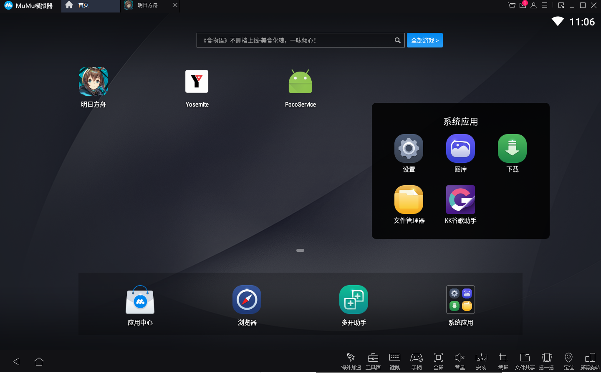
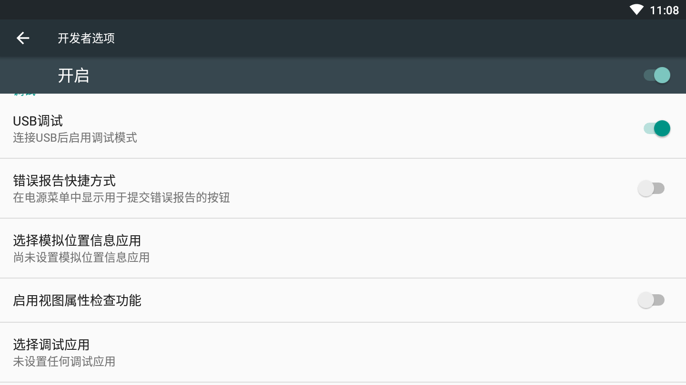
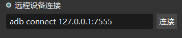
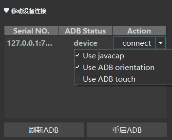
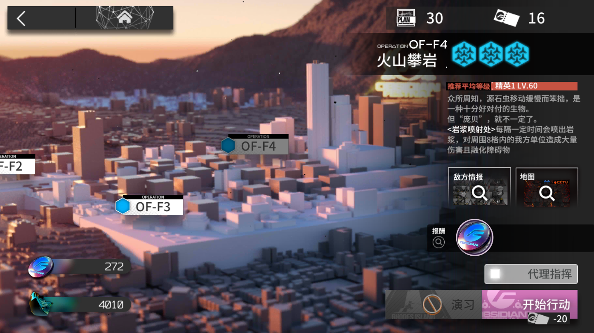
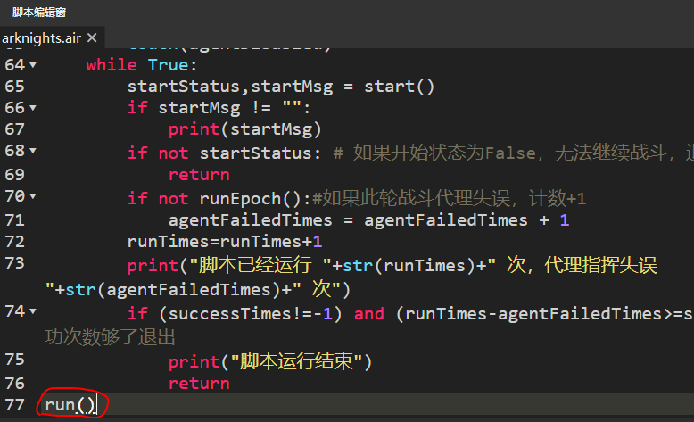

**请注意：该项目已废弃。mumu模拟器自带的操作录制足以应付刷图场景，而且游戏内关卡结算界面ui已发生变化，原识图功能不再有效**
# 明日方舟脚本使用指南
## 简述
该脚本基于Airtest IDE以及明日方舟PC模拟器编写，可对指定**已经可以代理指挥**的副本内反复战斗，自动使用理智合剂，并且记录战斗以及代理指挥失误次数。战斗的次数可以通过修改参数设置。

Airtest支持连接Android,ios和Android模拟器，该脚本仅在明日方舟PC模拟器测试过。如想使用真机请自行调试，不保证脚本能正常工作~
## 需要的软件
1. 明日方舟模拟器：访问[明日方舟官网](https://ak.hypergryph.com/index)，选择PC模拟器
2. Airtest IDE：访问[Airtest官网](http://airtest.netease.com/)
## 如何下载脚本？
#### 两种方法
1. ```git clone git@github.com:yeziyezi/airtest-arknights.git arknights.air```
2. Clone or download - Download ZIP，然后保存到本地并解压，重命名文件夹为arknights.air 
## 运行步骤
1. 运行Airtest IDE，关掉默认的utitled.air标签页
2. 运行明日方舟PC模拟器，登录游戏
3. 在ide中文件-打开脚本-点击arknights.air文件夹-ok，这时就可以看到脚本的内容了
4. 在模拟器-首页-设置-开发者选项中打开usb调试


5. 在Airtest IDE中选中```远程设备连接```旁边的白色圆点，输入```adb connect 127.0.0.1:7555```（这个其实是默认值），点击连接
6. 这时候上面的```移动设备连接```窗格下出现一个设备，点击下箭头，勾选前两项，然后点击connect,这样ide就和模拟器连接上了。这时右边的DeviceScreen中会显示模拟器的画面

7. 选择要刷的关卡，点击以下，使开始行动的图标显示在界面上，比如这样

8. 如果要指定刷的次数，比如要刷五次，就在脚本的最后一行```run()```改成```run(5)```，不指定次数则表示一直刷下去，理智不足时脚本会自动使用合剂，直到合剂消耗完为止。建议根据实际情况修改

9. 点击开始运行脚本，点击结束运行脚本。开始运行之前一定要保证模拟器显示的是如同第**7**条图中的界面


## 结语
如果指南中有哪里不清楚，或者使用脚本过程中存在问题，欢迎提issue，或发邮件给escyezi@foxmail.com，或加我的微信/qq：1015845532
